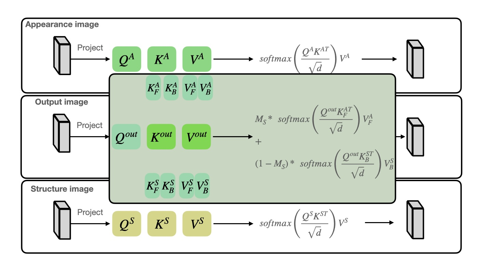
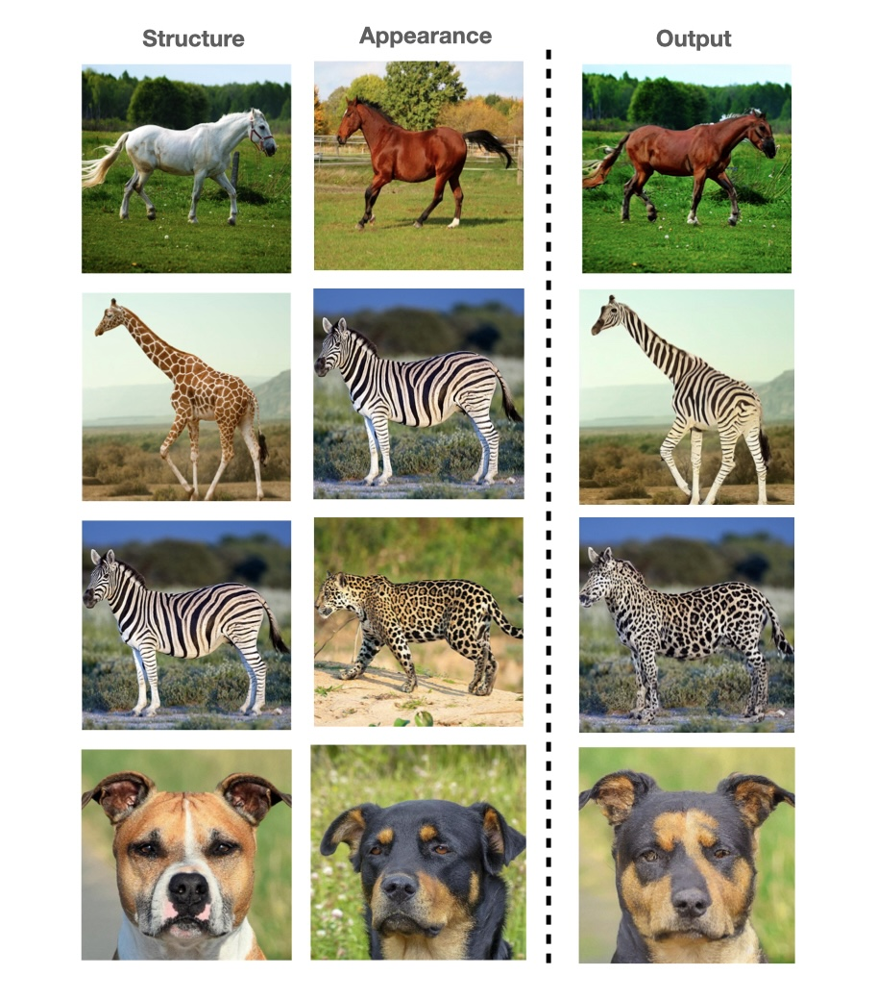
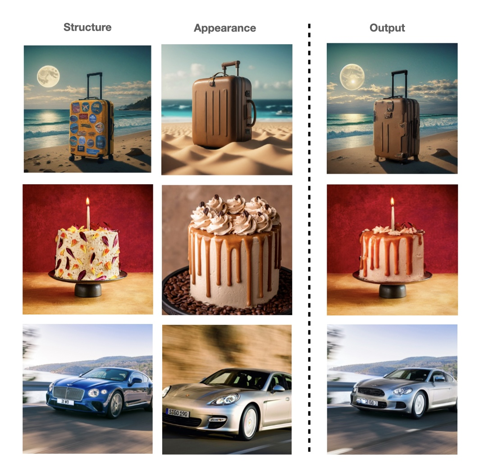
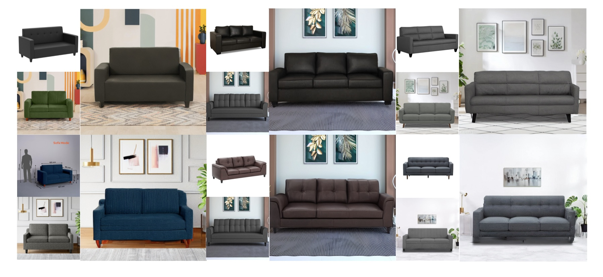

## Transferring Appearance with Mask-Guided Attention
Transferring appearance aims to transfer an object’s appearance in an appearance image to an object in the structure image so that background details 
are preserved and accurately reflect the characteristics of the object in the appearance image. It has several use cases, such as virtual-tryon, 
e-commerce product placement, etc. Existing works require either fine-tuning of the text-to-image diffusion models or are not applicable to the use case of virtual-tryon
and e-commerce object placement, which is not desirable. In this report, we present a Mask-Guided attention replacing existing self-attention in U-net that can be
readily incorporated into the [Masactrl](https://github.com/TencentARC/MasaCtrl), transferring the appearance without fine-tuning the model and applicable for a broad spectrum of use cases. 
Masks corresponding to object regions are obtained from SAM(Segment Anything Model). Extensive experiments are performed on shirt, jeans, tee shirt transfer 
onto a person and sofa transfer into a living space.
<centre></centre>


### Diffusion Sampling Process
<centre></centre>

### Mask Guided Attention
<centre></centre>

### Dependencies

Run the following to install all necessary python packages for our code.

```bash
pip install -r requirements.txt
```

### Usage
- First, extract the masks of the objects in the structure and appearance images using ```sam.ipynb```. 
- To generate an image, you can simply run the ```main.py``` script. For example,
```bash
python main.py \
--target  ./images/giraffe.png \
--target_prompt "A photo of a giraffe \
--src ./images/zebra.png \
--src_prompt "A photo of a zebra" \
```
- ```main.py``` also includes the Null-Text Inversion.

### Demo images
<p float="top">
  
   
</p>
<centre></centre>
<centre></centre>
<centre></centre>

### Acknowledgments
This code majorly builds on the code from the [Masactrl](https://github.com/TencentARC/MasaCtrl).


